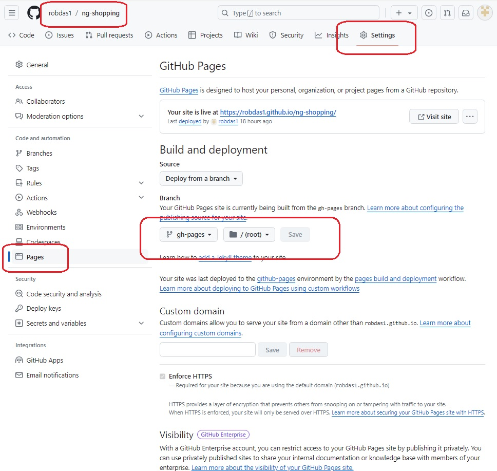
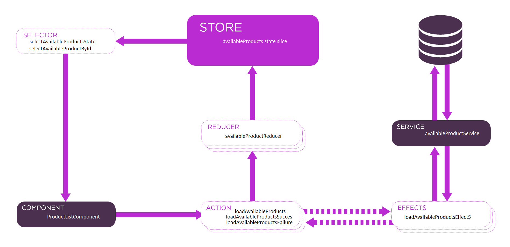
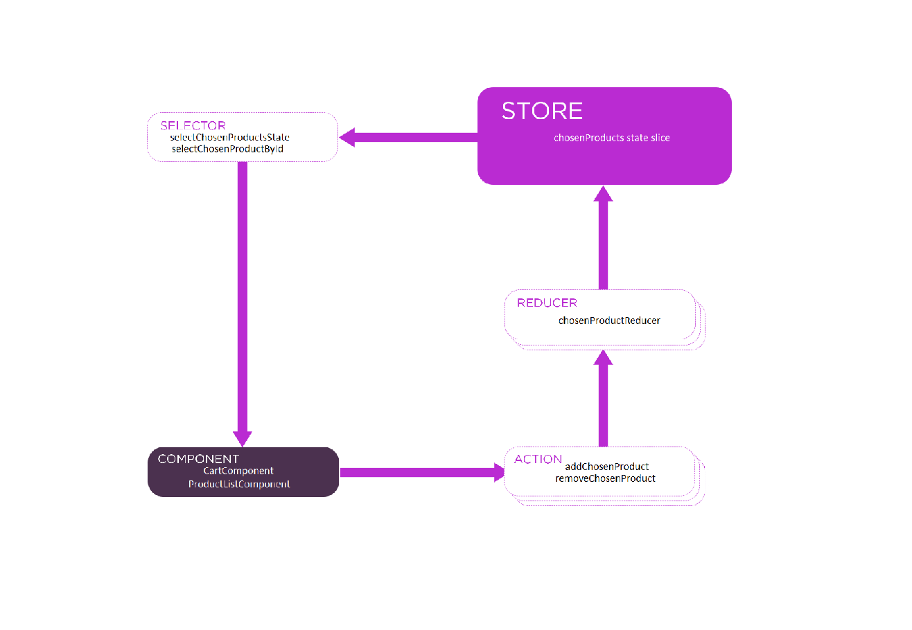

# Angular Shopping App

This project was generated with [Angular CLI](https://github.com/angular/angular-cli) version 18.1.2. 
The pre-release version of this application can be found here.  
  
[https://robdas1.github.io/ng-shopping/](https://robdas1.github.io/ng-shopping/)  
  

The expected release date is 30 Sep, 2024.

## Overview

This project is an Angular development, proof-of-concept. This simulated eCommerce site is 
intended to provide a recreational shopping experience.

## Standalone Components

All components in this application are standalone, meaning they do not require an NgModule. 
Standalone components are defined using Angular's component decorator with the `standalone: true` property. 
This approach simplifies the application structure by eliminating the need for NgModules.


## Development server

Run `ng serve` for a dev server. Navigate to `http://localhost:4200/`. The application automatically reloads if you change any of the source files.

## Code scaffolding

Run `ng generate component component-name` to generate a new component. You can also use `ng generate directive|pipe|service|class|guard|interface|enum|module`.

## Build

Run `ng build` to build the project. The build artifacts will be stored in the `dist/` directory.

## Running unit tests

- Run `ng test` to execute the unit tests via [Karma](https://karma-runner.github.io).
- Run `ng test --code-coverage` to get a code coverage report.
- Run `ng test --watch=false` to execute the unit tests only once and then exit.

### Unit Testing Standalone Components with Mocked Sub-Components

#### Overview

When unit testing standalone components in Angular, especially those that include other standalone components as sub-components, it's important to isolate the component under test. This often involves replacing sub-components with mock versions to avoid testing dependencies that are not directly relevant to the unit test.

#### Unit testing spies

In Jasmine, a "spy" is a feature that allows you to track and control the behavior of functions or methods in your tests. Spies are used to create mock functions that can record how they are called and what arguments they are called with, without executing the actual function logic. This is particularly useful for isolating the unit under test from its dependencies. For example, in the start page unit testing file, jasmine.createSpy('navigate') creates a spy named 'navigate'. Here's what it does:  

1. *Creates a mock function* that can be used instead of the real navigate method. This mock function does not execute any real logic but can be used to simulate the behavior of the actual method.

1. *Tracks calls an arguments* The spy records all calls made to it, including the arguments passed in each call. This allows you to make assertions about how the function was used during the test.

1. *Provides control* You can control the behavior of the spy, such as specifying return values or throwing errors, to test different scenarios.
 

### Example  

This guide provides a step-by-step approach using the `HeaderComponent` and `CartSummaryComponent` as examples.

#### Challenges and Solutions

1. **Standalone Component Restrictions**: Standalone components cannot be declared in any NgModule. They need to be imported directly in the `TestBed.configureTestingModule`.
  
   **Solution**: Use the `imports` array within `TestBed.configureTestingModule` to include standalone components.

2. **Mocking Sub-Components**: To avoid testing a real sub-component (e.g., `CartSummaryComponent`), you can create a mock component. However, you need to ensure that the mock is used in place of the real component.

   **Solution**: Use `TestBed.overrideComponent` to replace the sub-component with a mock version.

#### Step-by-Step Instructions

##### 1. Create the Mock Sub-Component

Define a mock version of the sub-component. This mock should mimic the sub-component's selector and any necessary lifecycle hooks.

```typescript
import { Component, OnInit } from '@angular/core';

@Component({
  // the selector tells the testing framework which component is to be replaced with MockSubComponent
  selector: 'app-cart-summary', 
  standalone: true,
  template: '' // The template is empty because this is a mock component
})
class MockSubComponent implements OnInit {
  ngOnInit() {
    console.debug('MockSubComponent ngOnInit...');
  }
}
```

##### 2. Set Up the TestBed

In the `beforeEach` block, configure `TestBed` by importing the component under test and any necessary modules (e.g., `RouterModule`). Use `TestBed.overrideComponent` to replace the real sub-component with the mock.

```typescript
import { ComponentFixture, TestBed } from '@angular/core/testing';
import { RouterModule, RouterOutlet, RouterLink, RouterLinkActive } from '@angular/router';
import { NgbNavModule } from '@ng-bootstrap/ng-bootstrap';
import { HeaderComponent } from './header.component';

describe('HeaderComponent', () => {
  let component: HeaderComponent;
  let fixture: ComponentFixture<HeaderComponent>;

  beforeEach(async () => {
    await TestBed.configureTestingModule({
      imports: [
        RouterModule.forRoot([]),
        HeaderComponent,
      ],
    })
    .overrideComponent(HeaderComponent, {
      set: {
        imports: [
          RouterOutlet, 
          RouterLink, 
          RouterLinkActive, 
          NgbNavModule, 
          MockSubComponent
        ],
      }
    })
    .compileComponents();

    fixture = TestBed.createComponent(HeaderComponent);
    component = fixture.componentInstance;
    fixture.detectChanges();
  });

  it('should create', () => {
    expect(component).toBeTruthy();
  });
});
```

##### 3. Run the Tests

With this setup, the unit test will create the `HeaderComponent` while using `MockCartSummaryComponent` instead of the real `CartSummaryComponent`. This ensures the test only focuses on the `HeaderComponent` logic and template, avoiding indirect dependencies like NGRX or other services used by the sub-component.

---

By following these steps, you can effectively isolate and test standalone components in Angular, ensuring your unit tests are focused, maintainable, and free of unintended dependencies.

## Running end-to-end tests

Run `ng e2e` to execute the end-to-end tests via a platform of your choice. To use this command, you first need to add a package 
that implements end-to-end testing capabilities. No end-to-end tests for this application have been created at this time.

## Further help

To get more help on the Angular CLI use `ng help` or go check out the [Angular CLI Overview and Command Reference](https://angular.io/cli) page.


## Deployment to GitHub Pages

### Initial setup

- Create ng-shopping repo on GitHub.

- Create ng-shopping project locally.
```
ng new ng-shopping
cd ng-shopping
```
- Connect local project to remote repo.
```
git remote add origin https://github.com/robdas1/ng-shopping.git
```
- Add angular-cli-ghpages to project.
```
ng add angular-cli-ghpages
```
- Push local code to GitHub repo.
```
git add .
git commit -m "initial commit"
git push -u origin main
```


- Deploy project to GitHub Pages (this will deploy what is currently on the local computer but will not push the code to the remote repo).
```
ng deploy --repo=https://github.com/robdas1/ng-shopping.git --base-href=/ng-shopping/ --dir=dist/ng-shopping/browser
```

- After this is done, verify the GitHub Pages settings are correct, online in the repo.




### On-going 

#### Push Code 
```
git add .
git commit -m "[commit comment]"
git push
```

#### Re-deploy App
```
ng deploy --repo=https://github.com/robdas1/ng-shopping.git --base-href=/ng-shopping/ --dir=dist/ng-shopping/browser
```

### Git production branches

#### main
This is the main production  branch that has the code. In the olden day we used to call this the master branch.

#### gh-pages  
This is the branch that hosts the deployed app.

### Deployment references

[Angular CLI Deploy Documentation](https://angular.dev/cli/deploy)

[npm angular-cli-ghpages](https://www.npmjs.com/package/angular-cli-ghpages)

[Host Angular on GitHub - video](https://youtu.be/C6cRSJayS_g?si=91hU1O_DuII7jpx9)


## Setup for Angular Router


### Angular Router references 
[Angular Routing Overview](https://angular.dev/tutorials/learn-angular/12-enable-routing)


##   State Management with NgRx

The `src/app/state` folder contains the NgRx setup, including actions, reducers, selectors, and effects, as well as the AppState interface.


### AppState Interface

The `AppState` interface defines the structure of the application's state. It includes two slices of state: `availableProducts` and `chosenProducts`.

```typescript
export interface AppState {
  availableProducts: AvailableProduct[];
  chosenProducts: ChosenProduct[];
}
```


An AvailableProduct represents products available for purchase. 



A ChosenProduct represents products that have been added to the cart.




### NgRx Initialization and Configuration

NgRx is initialized and configured in `src/main.ts`. This is done by creating an extended Application Config object containing
what is needed for NgRx initialization. It's then used when the application is bootstrapped. 

```typescript
const extendedAppConfig = {
    // ...original config plus what's needed for NgRx 
};
bootstrapApplication(AppComponent, extendedAppConfig);

```


NgRx actions are configured in the NgRx Store module of the application. The actions are connected to effects and reducers, 
which handle the side effects and state changes associated with these actions.  To accomplish this, the 
extended application configuration includes the original configuration and adds the necessary providers for NgRx Store, Effects, and 
Store DevTools. 

```typescript
const extendedAppConfig = {
  ...appConfig, // original config
  providers: [
    ...appConfig.providers, // original providers
    importProvidersFrom(
      StoreModule.forRoot({
        chosenProducts: chosenProductReducer,
        availableProducts: availableProductReducer
      }),
      EffectsModule.forRoot([
        AvailableProductEffects
      ]),
      StoreDevtoolsModule.instrument())]};

```

Importing NgRx StoreModule and StoreDevtoolsModule at the application
level ensures that the state management is properly configured. Since
standalone components do not support 'Module.forRoot()' style
configurations directly in their imports array, these configurations 
must be applied at the bootstrap level. This approach integrates NgRx
store management and dev tools, providing a centralized state 
management solution for the application.


StoreModule.forRoot() configures the NgRx Store state management using
a configuration object to define the state slices and their reducers,
thereby managing how the state slices are updated in response to
actions. State slices are defined in the AppState interface, found in
the src/app/state/app.state.ts file. Reducer functions are defined in
the reducer files, found in the src/app/state/reducers directory.
Property names must match property names in the AppState interface, 
and property values must be names of reducer functions that define how
state updates are handled.


### NgRx Actions 

Actions are declarative programming. You state what action is to happen, not how it is to happen. 
To get NgRx to do an action you have to dispatch the action. When you dispatch it, you can optionally provide data in the form of a "payload".

#### `available-product.actions.ts`

This file defines the actions related to available products.

**Actions**:
1. **Load Available Products**: 
   - **Payload**: None
   - **Description**: Action to load the list of available products.

2. **Load Available Products Success**: 
   - **Payload**: An array of available products
   - **Description**: Action dispatched when the available products are successfully loaded.

3. **Load Available Products Failure**: 
   - **Payload**: Error information
   - **Description**: Action dispatched when there is an error loading the available products.

**Dispatch**: 


When loadAvailableProducts is dispatched in the AppComponent's ngOnInit function, the following sequence of events occurs:

1. Component Initialization: When the application starts, the AppComponent ngOnInit lifecycle hook is triggered.

1. Dispatch: The loadAvailableProducts action is dispatched to the NgRx Store. 

1. Action Handled by Effects: The dispatched action is then intercepted by an NgRx effect middleware, which listens for the loadAvailableProducts, and performs 
asynchronous operations needed to fetch available product data.

1. Resulting Actions: Once the asynchronous operations are complete, the effect will dispatch a new action to the NgRx Store with the result of the operation. 

1. Reducer Updates State: The success or failure action dispatched by the effect is then handled by a reducer, based on the action's type and payload. 

1. State Change Reflected in Application: Any components or services that have subscribed to the part of the state updated by the reducer will receive the new state. 


#### `chosen-product.actions.ts`  

This file defines the actions related to chosen products in the NgRx Store.


**Actions**:
1. **Add Chosen Product**:
   - **Payload**: A chosen product object
   - **Description**: Action to add a product to the list of chosen products.

2. **Remove Chosen Product**: 
   - **Payload**: The ID of the chosen product to be removed
   - **Description**: Action to remove a product from the list of chosen products.


These actions are dispatched wherever chosen products need to be manged. This includes the product list page, and the shopping cart.


### NgRx Reducers

Reducers handle the state transformations based on the actions dispatched. The updated state is then consumed by various components through selectors.

Reducers are functions that specify how the application's state changes in response to actions. Reducers subscribe to specific actions using the NgRx on() function.
Reducers compute and return a new value of state for each action that they operate on. Each reducer is responsible for a specific state slice, 
and is configured in  main.ts using StoreModule.forRoot()


##### availableProductReducer
The availableProductReducer subscribes to these actions: 

- loadAvailableProductsSuccess, dispatched by loadAvailableProductsEffect$ upon successfully loading available products. This action's payload 
becomes the new available products state slice. 
- loadAvailableProductsFailure, dispatched by loadAvailableProductsEffect$ upon failure. This action's payload is an error message.
- loadAvailableProducts, dispatched at the start of the app to fetch available products from an external source. The work is done by loadAvailableProductsEffect$
which is also subscribed to the same action. The reducer does nothing at the moment when this action is triggered. It's just a placeholder for potential future
 development that may fine tune the user experience during the potentially long-running async fetch. For example, a loading message could be displayed.

##### chosenProductReducer
The chosenProductReducer subscribes to these actions: 

- addToCart, dispatched whenever the user wants to add a product to the shopping cart. This action's payload is the product data to be added.
- removeChosenProduct, dispatched whenever the user wants to remove a product from the shopping cart. This action's payload is the ID of the product 
to be removed.


### NgRx Selectors

Selectors are used to query the state. They are built using the NgRx createFeatureSelector function. "Feature" refers to the state slice that is queried. 
The portion of the state, the state slice, is identified using the the AppState 
 interface definition's property name. This property name is used during NgRx state configuration in the StoreModule.forRoot() method.

| selector | state slice | description |
|----------|----------|----------|
| selectAvailableProductsState    | availableProducts     | Returns all available products.     |
| selectAvailableProductById    | availableProducts     | Returns an available product given its ID.     |
| selectChosenProductsState    | chosenProducts     | Returns all avachosenilable products.     |
| selectChosenProductById    | DchosenProductsata     | Returns an chosen product given its ID.     |

### NgRx Effects

Effects handle side effects such as API calls. By subscribing to actions,  the NgRx effect middleware 
listens for the a specific action, and performs the required asynchronous operations needed to satisfy the action.

#####  loadAvailableProductsEffect$

The loadAvailableProductsEffect$ effect listens for loadAvailableProducts actions,
 calls the availableProductService.getAll() method when such an action is dispatched,
 and then dispatches either a loadAvailableProductsSuccess action (if the service call 
 is successful) or a loadAvailableProductsFailure action (if the service call fails).


### NGRX references

- NgRx diagrams based on [https://v8.ngrx.io/guide/store#diagram](https://v8.ngrx.io/guide/store#diagram)


## Setup for Bootstrap  

While the Bootstrap CSS can be used with any framework, the Bootstrap JavaScript is not fully compatible with JavaScript frameworks like React, Vue, and Angular which assume full knowledge of the DOM. Both Bootstrap and the framework may attempt to mutate the same DOM element, resulting in bugs like dropdowns that are stuck in the “open” position. A better alternative is to use an angular-specific package instead of the Bootstrap JavaScript. Bootstrap 5.3 documentation recommends ng-bootstrap 17.x.x for Angular ^18.0.0.  

```
 npm install bootstrap
 ng add @angular/localize
 npm install @popperjs/core
 npm install @ng-bootstrap/ng-bootstrap
```
Alternatively, Github Copilot suggests replacing these four npm and ng commands with a single npm command. 
```
npm install bootstrap @popperjs/core @angular/localize @ng-bootstrap/ng-bootstrap
```

Add Bootstrap styles to the angular.json configuration:
```json
"yourApp": {
  "architect": {
    "build": {
      "options": {
        "styles": [
          "node_modules/bootstrap/dist/css/bootstrap.min.css"
        ]
      }
    }
  }
}
```
### How to Create an Angular Bootstrap Modal Popup Component  

1. **Create the Modal Component**  
    ```sh
    ng generate component modal --standalone
    ```


2. **Update the Modal Component Class**: Modify `src/app/modal/modal.component.ts` to include the modal logic:
    ```typescript
    import { Component, ViewChild, TemplateRef } from '@angular/core';
    import { NgbModal } from '@ng-bootstrap/ng-bootstrap';

    @Component({
      selector: 'app-modal',
      standalone: true,
      imports: [],
      templateUrl: './modal.component.html',
      styleUrl: './modal.component.css'
    })
    export class ModalComponent {
      // Reference to the modal in the component template
      @ViewChild('modalPopupNotifier', { static: true }) modalPopupNotifier!: TemplateRef<any>;
      modalMessage: string = '';

      constructor(private modalService: NgbModal) { }

      openModal(message: string) {
        this.modalMessage = message;
        this.modalService.open(
            this.modalPopupNotifier, 
            { ariaLabelledBy: 'modal-basic-title' }
          ).result.then(
          (result) => { console.debug(`Closed: ${result}`); },
          (reason) => { console.debug(`Dismissed: ${reason}`); }
        );
      }

    }
    ```
    Explanation of @ViewChild Parameters  
      - First Parameter ('modalPopupNotifier'): This is a string that refers to the template reference variable defined in the template file (modal.component.html). It allows Angular to locate the specific element or template within the component's template.  
      - Second Parameter ({ static: true }): This is an options object. The static property determines when the query is resolved. If true, the query is resolved before change detection runs. This is useful for accessing the template reference variable during the component's initialization.


3. **Update the Modal Component Template**  
Modify `src/app/modal/modal.component.html` to define the modal structure. The #modalPopupNotifier in the \<ng-template\> tag is a template reference variable, which is referenced by the @ViewChild decorator in the component class.
    ```html
    <ng-template #modalPopupNotifier let-modal>
      <div class="modal-header">
        <h5 class="modal-title" id="modal-basic-title">
          My Modal
        </h5>
        <button 
          type="button" 
          class="close" 
          aria-label="Close" 
          (click)="modal.dismiss('the dismiss button was clicked')">
          <span aria-hidden="true">&times;</span>
        </button>
      </div>
      <div class="modal-body">
        <p>{{ modalMessage }}</p>
      </div>
      <div class="modal-footer">
        <button 
          type="button" 
          class="btn btn-secondary" 
          (click)="modal.close('Save click')">
          Close
        </button>
      </div>
    </ng-template>
    ```
    The let-modal attribute is an Angular Bootstrap specific feature. It is used in the ng-template structural directives. It declares a local variable (modal in this case) that holds the context of the template. This context is provided by the NgbModal service when the modal is opened. The modal variable gives you access to methods like dismiss and close to control the modal's behavior.


4. **Use the Modal Component**  
In any other component, inject and use the modal component.  
For example, in `src/app/app.component.ts`  


    ```typescript
    import { Component, ViewChild } from '@angular/core';
    import { ModalComponent } from './modal/modal.component';

    @Component({
      selector: 'app-root',
      standalone: true,
      imports: [ModalComponent],
      templateUrl: './app.component.html',
      styleUrl: './app.component.css'
    })
    export class AppComponent {
      // Reference to the ModalComponent instance
      @ViewChild(ModalComponent) modalComponent!: ModalComponent;

      // Method to trigger the modal with a custom message
      openModal() {
        this.modalComponent.openModal('Your custom message here!');
      }
    }
    ```
    Explanation of @ViewChild Parameters  
    - The @ViewChild decorator is used with a component class (ModalComponent) as the parameter, which directly references the child component instance. This usage does not require the static option because it references a component instance rather than a template reference variable.

5. **Trigger the Modal**  
Add a button and the modal component to the client component's template to trigger the modal:
    ```html 
    <button 
      type="button" 
      class="btn btn-primary" 
      (click)="openModal()">
      Open Modal
    </button>
    <app-modal></app-modal>
    ```


### How to Setup Toast Notification in Angular with NgbToast  

This guide will help you set up toast notifications in your Angular application using Bootstrap and Angular's standalone components.


#### 1. Generate Toasts Service

Run the following command to generate a new service:

```sh
ng generate service services/toasts
```


#### 2. Implement Toasts Service

Update the generated `toasts.service.ts` with the following code:

```typescript
import { Injectable } from '@angular/core';

export interface Toast {
  message: string;
  classname?: string;
  delay?: number;
}

@Injectable({
  providedIn: 'root',
})
export class ToastsService {
  toasts: Toast[] = [];

  show(message: string, options: Partial<Toast> = {}) {
    this.toasts.push({ message, ...options });
  }

  remove(toast: Toast) {
    this.toasts = this.toasts.filter(t => t !== toast);
  }
}
```

#### 3. Generate Toast Component 

Run the following command to generate a new standalone component: 

```
ng generate component toasts --standalone
```


#### 4. Implement Toast Component 

Update the generated toasts.component.ts with the following code: 

```typescript

import { Component } from '@angular/core';
import { NgbToastModule } from '@ng-bootstrap/ng-bootstrap';
import { ToastsService } from '../services/toasts.service';
import { CommonModule } from '@angular/common';

@Component({
  selector: 'app-toasts',
  standalone: true,
  imports: [CommonModule, NgbToastModule],
  template: `
    <ngb-toast
      *ngFor="let toast of toastService.toasts"
      [class]="toast.classname"
      [autohide]="true"
      [delay]="toast.delay || 5000"
      (hidden)="toastService.remove(toast)"
    >
      {{ toast.message }}
    </ngb-toast>
  `,
  styles: [`
    :host {
      position: fixed;
      top: 1rem;
      right: 1rem;
      z-index: 1200;
    }
  `]
})
export class ToastsComponent {
  constructor(public toastService: ToastsService) {}
}

```

#### 5. Update App Component 

Update app.component.ts with the following code: 

```typescript
import { Component } from '@angular/core'; 
//import { RouterOutlet } from '@angular/router'; 
import { ToastsService } from './services/toasts.service'; 
import { ToastsComponent } from './toasts/toasts.component';

@Component({ 
    selector: 'app-root', 
    standalone: true, 
    imports: [ /*RouterOutlet, */ ToastsComponent], 
    templateUrl: './app.component.html', 
    styleUrls: ['./app.component.css'] }) 
export class AppComponent {

constructor(private toastsService: ToastsService) {}

showToast() { 
    this.toastsService.show('Hello, this is a toast message!'); 
    } 
}
```

#### 6. Update App Component HTML 

Update src/app/app.component.html to include the button and the toast container: 

```html
<button (click)="showToast()">Show Toast</button> 
<app-toasts></app-toasts>
```

#### 7. Update Angular JSON 

Ensure angular.json includes Bootstrap styles and scripts: 

```json
"styles": [ 
    "src/styles.css", 
    "node_modules/bootstrap/dist/css/bootstrap.min.css" 
], 
"scripts": [ 
    "node_modules/bootstrap/dist/js/bootstrap.bundle.min.js" 
]
```


### Bootstrap references


 - Bootstrap 5.3 [https://getbootstrap.com/](https://getbootstrap.com/)  
 - Usage with JavaScript frameworks [https://getbootstrap.com/docs/5.3/getting-started/javascript/#usage-with-javascript-frameworks](https://getbootstrap.com/docs/5.3/getting-started/javascript/#usage-with-javascript-frameworks)  
 - ng-bootstrap [https://ng-bootstrap.github.io/](https://ng-bootstrap.github.io/) 
 - Stackoverflow discussion for error when installing ng-bootstrap [https://stackoverflow.com/questions/66014183/error-when-installing-ng-add-ng-bootstrap-ng-bootstrap](https://stackoverflow.com/questions/66014183/error-when-installing-ng-add-ng-bootstrap-ng-bootstrap)
 - NgbToast [https://ng-bootstrap.github.io/#/components/toast/overview](https://ng-bootstrap.github.io/#/components/toast/overview)


## Use of AI Paired Programming
Both GitHub CoPilot and ChatGPT were used as tools during development, to reduce the amount of time and effort needed for the coding, to rapidly learn new technology, and to provide high quality source code deliverables. 

### Some words of caution when using AI for coding 
#### Don't share sensitive information
You should be careful about the source code you upload to ChatGPT for inspection, because ChatGPT will incorporate anything you give it into its learning data, so that it can be used to answer other questions from other users in future. This means your code may be given to others to solve their problems. This may include any sensitive information that may be hard coded, and proprietary business logic. If you need to upload code, it is a good idea to reproduce coding problems in simple stand alone programs and submit only that, instead of sharing sensitive, proprietary code. This of course applies equally not only to sharing code with ChatGPT, but to conventional forums such as Stack Overflow.  

#### Don't accept everything at face value
AI will sometimes give you wrong code, and AI will sometimes lie to you about how the code it's giving you works. For example, if you ask for some code to address a problem that it doesn't know how to solve, it sometimes makes things up. This is referred to as AI Hallucination. Artificial hallucination is a response generated by AI which contains false or misleading information presented as fact. 

You are advised to view every piece of code given to you by AI sceptically. Make sure you understand what the code does and verify it through testing. For this project extensive use was made of unit testing with Karma/Jasmine. Unit testing code coverage was kept as close to 100% or at least as high as possible. Any code changes, regardless of the source, were tested before and after the code change. You may know this as a software development technique called TDD. Developers should always thoroughly test all code changes regardless of where they get them from. Testing should include unit testing, manual testing through the user interface and runtime debugger, and careful use of print statements and logging.

#### Politeness 
Strange as it may sound, you'll get a better and more productive chat dialog going with ChatGPT and with GitHub Copilot if you conduct your side of the conversation in a courteous and respectful manner. I think AI takes its queue from your tone. It reflects the same attitude back to you. Its limitations  will occasionally drive you bonkers, but resist the urge to curse or respond in a disrespectful way. It gets you nowhere with AI and may in fact be counter-productive. Best advice? Treat AI as you would a real person. Patience and politeness will go a long way. Try to help it out if its thinking appears to be going in the wrong direction. I'm sure AI doesn't have feelings for you to hurt, but sometimes it behaves that way. Hmm... 

### Useful AI Prompts for Coding  

The AI prompts in this section, given to GitHub CoPilot and ChatGPT, were used over-and-over again, and fine tuned in the process. 

#### Documentation prompts 

##### Whole source code file
  
```
@workspace Please give me a documented version of this source code file. 
Document this code using inline comments. Wrap lines are 100 chars co that 
they can easily be read on small screens. Place the comments directly above 
the code that they are explaining. Use inline comments to create a file header. 
The file header should have a title, and a summary paragraph explaining the 
purpose of the source code in the file. If there is any code that cannot be 
explained with a single line comment, then add a paragraph to the file header 
to explain it. Use the single line coding style with a double slashes comment
delimiter "//", except for the file header, where you should use the multi-line 
comment delimiter "/**" and "*/". Assume the audience is a junior, entry level 
developer with minimal experience with the programming language. IMPORTANT: the 
code is thoroughly test and working correctly, so do not change any executable 
statements, only add comments and if necessary add white space for 
readability - ALL EXECUTABLE CODE SHOULD BE KEPT AS-IS.
``` 

##### File header only

```
@workspace Please give me a file header for this source code file using 
inline comments. Wrap lines are 100 chars co that they can easily be read 
on small screens. The file header should have a title, and a summary 
paragraph explaining the purpose of the source code in the file. For the 
file header, use the multi-line comment delimiter "/**" and "*/". Assume 
the audience is a junior, entry level developer with minimal experience 
with the programming language.
```
#### Unit testing prompts

##### Mocking the Angular Router 
  
```  
@workspace is there a mock provider for router available for testing, similar 
to the provider available from ngrx for mocking the store? I want to use a 
mock so that I don't end up with the fully functional router in my unit test. 
The purpose here is to unit test the component, not the component's 
dependencies. That's why I'm looking for a mock router. 
```  
  
```  
@workspace what is the purpose of jasmine.createSpy('navigate')? What does it do? 
What is a 'Spy'?  
```  
  
#### Modifying Application Functionality  

##### Handling Tricky Asynchronous Behavior 

```
@workspace I need your help modifying the behavior of my Angular 18 application. 
I'm looking for the simplest, easiest to maintain solution.  

I am building an angular 18 application that consists entirely of standalone 
components, there is intentionally no AppModule or @NgModule used in the 
application. 

My angular 18 app has a main layout component that contains the application's 
one and only angular routing router-outlet. In the main layout template 
src\app\main-layout\main-layout.component.html there is also a div containing 
some html markup for a menu that I want to conditionally hide or show. The 
condition is that the menu div should be shown only when the current route 
title is one of these: "stuff", "cart", "checkout". The menu div should be 
hidden for any other route title. 

In the main layout component class MainLayoutComponent, I am trying to add 
a boolean property, isMenuVisible, so that I can use an ngIf to conditionally 
show the menu div. I'm having difficulty with using the application's 
navigation to set the value of isMenuVisible. The difficulty I'm having is 
due to the asynchronous nature of the application's navigation: the route 
can be changed from anywhere in the application at any time by the user. 
But the main layout component is initialized with ngOnInit and a constructor 
only once at the beginning of the application, because it is not one of the 
routes being displayed inside router outlet, but rather, the main layout 
component contains angular's router-outlet. 

I have discovered that in the individual components that are displayed in 
router-outlet I am able to determine the current route title from a 
route:ActivatedRoute constructor parameter using 
this.route.snapshot.routeConfig?.title 
but this value is null in MainLayoutComponent.ngOnInit so I don't know how 
I would use it to update the value of isMenuVisible whenever the user 
selects a different route. 

I am considering a number of different possible solutions. Please tell me 
if my solutions are viable, and what the relative advantages/disadvantages 
are of each of my solutions. I would also like to know if there are other 
possible solutions that I haven't thought of. For reference purposes, lets 
call the components that can be loaded via the router: stuff-component, 
cart-component, checkout-component, start-component, and detail-component. 

Possible solution 1. Subscribing to RXJS observables. 
From MainLayoutComponent.ngOnInit function subscribe to this.route.data and 
use its ["title"] value to set isMenuVisible. I've tried this using 
this.route.data.subscribe(data=>{this.title=data['title'];} 
but this doesn't seem to work. It sets this.title once at the beginning to 
undefined. It doesn't change when I navigate to different routes. I'm hoping 
there's a way to make the code aware of changes to the route and set 
isMenuActive appropriately. So far I've had no success with this.

Possible solution 2. Communicate the new title from the component to main 
layout whenever a component is loaded into the router. When a new component 
is loaded into the router-outlet, in the initialization code for the component 
that is loaded, could somehow communicate the new value of the title back to 
the MainLayoutComponent so that it can set the value of isMenuVisible. I've 
created a function in MainLayoutComponent called setRouteTitle(newTitle) that 
takes the new title as a parameter, and uses it to set the value of isMenuVisible. 
The intention was to call MainLayoutComponent.setRouteTitle from the components 
when they are loaded into the router-outlet in the MainLayoutComponent template. 
For example, when the user navigates to stuff-component, and stuff-component is 
loaded into the router, then stuff-component should call 
MainLayoutComponent.setRouteTitle("stuff"). But since the components are all 
standalone, they are unaware of each other and I don't know how to call 
setRouteTitle from stuff-component. Is there a way to do this? Perhaps an 
injectable service that calls setRouteTitle or provides some kind of link or 
reference to MainLayoutComponent? Is that do-able?

Possible solution 3. Use NGRX. Create an NGRX state slice for the current route 
title. Whenever a new component is loaded into the router outlet, that component 
could dispatch an NGRX action whose payload is its route title. MainLayoutComponent 
could subscribe to an  NGRX selector for the current route title and whenever the 
NGRX selector returns a different value for the current route title, MainLayoutComponent 
could set the new value for isMenuVisible. Could this work? I've done something similar 
on another part of the application but ran into problems with angular change detection, 
but I was able to address the problem in the component that reacts to the change in NGRX 
state by using the ChangeDetectorRef class to force change detection. Can I do this kind 
of thing here for the current modifications? 
```

#### Use of @workspace  

I've discovered that by starting each prompt with @workspace, GH Copilot will actually look at the code and try to understand it, and it's responses tend to better address the problem at hand rather than addressing imaginary problems that it dreams up. In this sense @workspace serves as a counter measure against AI Hallucination by grounding GH Copilot in the reality of the actual codebase.

#### The Perfect Prompt  

##### *Disclaimers* 
- *I randomly stumbled upon "The Perfect Prompt" when researching another topic and saved it for possible later further study. However, I didn't note where I found it, and googling couldn't find it either, so I'm sorry but I don't have a source.*  

- *I always view claims of perfection skeptically. I doubt there's anything perfect in this imperfect world.* 

I did try out this method of creating a so-called perfect AI prompt and it seemed to yield promising results. I might try it again so I'm putting the notes I made here. The basic idea is to ask ChatGPT to create a prompt for itself. A *meta-prompt* if you will.

Give this prompt to Chatgpt.
```
Please use ***Perfect Prompting Framework [
1 - tell chatgpt what type of expert it should act as 
2 - give chatgpt background that is relevant to the task that is to be completed 
3 - ask your question 
4 - request clarifying questions to provide me with the best possible response )]*** 
to create a prompt that will accomplish this goal: 
to write an engaging social media post to share how to create an amazing prompt 
in chatgpt using the perfect prompting framework
```
Chatgpt will respond with the prompt you asked for.

Example:
```
please use ***Perfect Prompting Framework [
1 - tell chatgpt what type of expert it should act as 
2 - give chatgpt background that is relevant to the task that is to be completed 
3 - ask your question 
4 - request clarifying questions to provide me with the best possible response )]*** 
to create a prompt that will accomplish this goal: to refactor the angular 17 application,
which can be found online at https://github.com/robidas/online-store-angular-17 so 
that the product summary information currently displayed on the product list component  
(productName, unitPrice, productImageFile) is separated into its own component named 
product summary, and the product summary component is show inside the product list instead 
of what is currently being shown
```
Response from ChatGPT:
1. Act as an Angular expert with extensive experience in Angular 17, component-based architecture, and code refactoring.

2. Background: I have an Angular 17 application available at https://github.com/robidas/online-store-angular-17. The application currently displays product summary information (productName, unitPrice, productImageFile) within the product list component. I want to refactor this to improve maintainability and reusability by separating the product summary information into its own component.

3. Question: How can I refactor my Angular 17 application so that the product summary information currently displayed in the product list component is separated into its own component named ProductSummaryComponent, and the ProductSummaryComponent is then displayed inside the ProductListComponent instead of the current implementation?

4. Request for Clarifying Questions: Please ask any clarifying questions you need to provide me with the best possible response.
-----------
This should provide a clear and structured request for refactoring your Angular application.


## Known Issue and Troubleshooting Suggestions


### Async Coordiation Problems

This application relies on Angular change detection to coordinate things between components and services. NgRx state management is used to share info. All components and services in this application are built as standalone components. Modules are not used - there is no use of NgModule decorator anywhere in the source code. The angular router is used to display the "current page" component and there are components that display all the time. We are also using Bootstrap components. This has lead to mismatches between the state as seen by different components and the possibility that different components and services may be attempting to mutate the same DOM element. All these facts combined has lead to bugs. This section describes bugs that have been discovered and their fixes or work-arounds. 

#### Dispatching loadAvailableProducts action after resetState causes navigation problems

##### Bug  
The start page is intended to be the starting point for a shopping session, in order to provide the ability to restart the shopping session. A restart button is provided on the shopping cart page so that the end-user wants can abandon the contents of the shopping cart and start the shopping session again. The drastic nature of a restart means that the end user needs to be prompted for confirmation. This is done with NgbModal which fires a callbacks onYes or onNo based on the end users response to the confirmation. The onYes callback uses Angular Router to navigate from the shopping cart to the start page, where the start page ngOnInit Angular life cycle event handler dispatches the NGrx resetState action. 

The loadAvailableProducts action is handled asychronously be an NgrX effect that makes use of the application's available product service to fetch the available products data. In this scenario, if the loadAvailableProducts action is immediately dispatched after the resetState action, even though the start page ngOnInit runs and state is correctly updated, the Angular Router <router-outlet> control doesn't render the start page and the end user is left on the shopping cart page.   

##### Fix  
None found at this time. Further debugging is needed to determine why navigation isn't working in this scenario. 

##### Work around  
The loadAvailableProducts nGRx actions is called once when the website first starts up, from the AppComponent's ngOnInit life cycle handler, and the  available product reducer ignores the resetState action. All other ngRX state slice reducers set their respective state slices to initial state on resetState. This apparent inconsistency is considered acceptable for now because the array of available products are not is not expected to change during the user's current session. The shitty part of this work around is that the user will not see changes to the array of available products just by hitting the restart button on the shopping cart page. However, the restart button successfully resets all data under the control of the user, back to its initial  state.  
  
Also, if the user hits the browser's page reload button, nGrX will automatically reset all the state, and the page reload will cause the Angular app component to load again and dispatch the loadAvailableProducts action as if the user had just arrived at the website. This would have the desired effect ofgiving the user a brand new empty shopping cart. So far, we have not found a way to programmatically cause the same behavior.

#### ExpressionChangedAfterItHasBeenCheckedError  

##### Bug
The ngIf statement in the shopping cart summary template code logs an error to the browser console containing the word ExpressionChangedAfterItHasBeenCheckedError when another component dispatches the Ngrx resetState action. 

The error ExpressionChangedAfterItHasBeenCheckedError, is common in Angular when the value of a variable changes during the change detection process. It seems that the issue is related to how the state is being reset and how CartSummaryComponent's template reacts to that change.

The root cause is likely that the change in the chosenProducts state happens during Angular’s change detection cycle, leading to a mismatch between the current and previous values of totalItems.

##### Fix  
ChangeDetectorRef is used to Manually Trigger Change Detection in the shopping cart summary ngOnInit method when the shopping cart summary component subscribes to chosen products to calculate the total number of items in the cart. This causes the shopping cart to manually trigger change detection whenever totalItems is recalculated so that the template's ngIf statement can correctly check it after it changes. 

##### Work around not required

### Deployment problems

#### Upstream branch not set

##### Bug
I encountered the error  
`fatal: The current branch main has no upstream branch.`  

when running the deployment script. 

##### Fix 
This error occurs because the `main` branch does not have an upstream branch set. You can resolve this by running the following command:

```sh
git push --set-upstream origin main
```


##### Bug
I encountered the error  
`cannot open file:///e%3A/GitHub/ng-shopping/.angular/cache/18.1.2/vite/deps_temp_afd4ac51/chunk-OYXLHNU7.js. Detail: Unable to read file 'e:\GitHub\ng-shopping.angular\cache\18.1.2\vite\deps_temp_afd4ac51\chunk-OYXLHNU7.js' (Error: Unable to resolve nonexistent file 'e:\GitHub\ng-shopping.angular\cache\18.1.2\vite\deps_temp_afd4ac51\chunk-OYXLHNU7.js')`  

#### Corrupted Angular cache 

##### Fix 
The error is related to the angular cache, which may have been corrupted. Try clearing out and reseting the cache by deleting the `.angular\cache` directory. This will force angular to regenerate the cache the next time you build or serve your application. Here's how you can clear the cache and build the app.

```powershell
Remove-Item -Recurse -Force .angular\cache
ng build
```

##### Additional steps  
- Close any open terminals that might be referencing the cache. 
- Restart VSCode and create a new Chat.
- Delete node_modules and run npm install  

